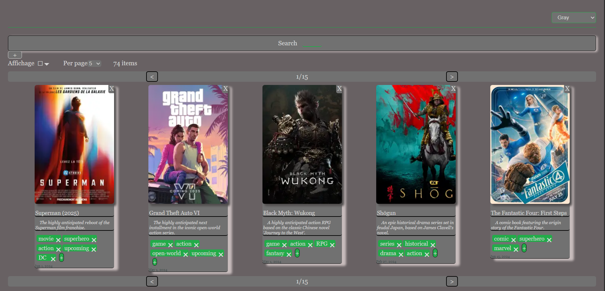

# Wish List Application


A CRUD app for wishes


*screenshot of the app*

## Features

- **Wish Management**: Create, update, and delete wishes with names, comments, tags, and images
- **Real-time Search**: Fuzzy search across wish names, comments, and tags with instant filtering
- **Image Processing**: Upload images with automatic resizing using Sharp
- **Online Image Search**: web scraping images to associate with a wish (Playwright)
- **Tag System**: Organize wishes with multiple tags and visual tag management
- **Database Persistence**: the data is persisted with PostgreSQL via PrismaORM
- **Type-Safety**: Zod schemas shared between frontend and backend

## 🛠 Tech Stack

* **Frontend** : Angular 19,  TypeScript , Zod

* **Backend** : Node.js, Express, TypeScript, Prisma ORM, Sharp , Playwright (for web scraping)

* **Infrastructure** : nginx, PostgreSQL 17, Docker, dotenvx

## Production
```bash
docker compose up
```

The application will be available at:
- Frontend: http://localhost:8080
- Backend API: http://localhost:3000


## 💻 Development

```bash
npm run dev                     # Runs both backend and frontend concurrently

# or
npm -w api-db run dev  # Runs only backend
npm -w angular-app run start  # Runs only frontend
```

The application will be available at:
- Frontend: http://localhost:4200
- Backend API: http://localhost:3000


## 🧪 Testing

```bash
npm test  # Run all tests         

# or
npm -w api-db test  # Backend tests
npm -w angular-app test  # Frontend tests
```

## 📁 Project Structure

```

├── angular-app/           # Angular frontend application
│   ├── src/app/            # Components
│   ├── src/schemas/        # Zod schemas specific to frontend
│   └── src/ui/             # Reusable UI components
├── api-db/                # Backend
│   ├── src/server.ts       # Express backend 
│   ├── src/api-get-image   # Scrapper 
│   ├── src/spec            # Tests
│   ├── src/init            # Data to initialise the database 
│   └── prisma/             # Database schema              
├── packages/ 
│    └── shared-schemas/   # Shared Zod validation schemas
└── docker-compose.yaml    # Docker deployment

```

## 🎯 Future imporvements

- Export/import functionality
- History

---